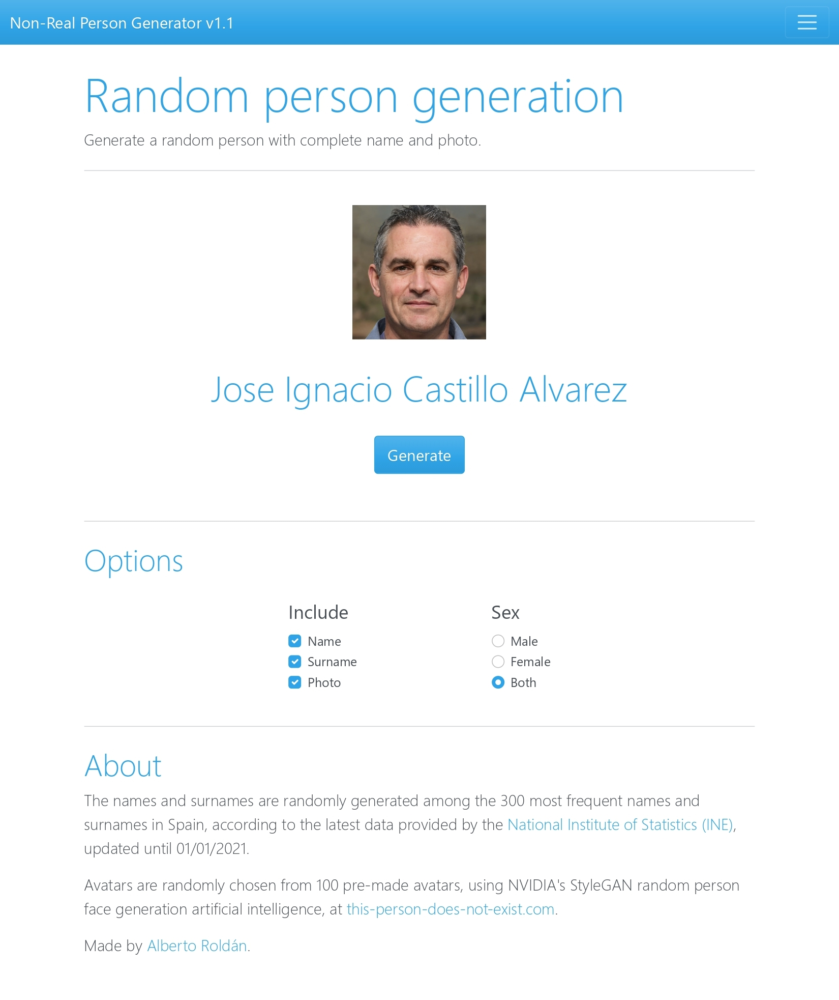

# Non-Real Person Generator 👤
Generate a random person with complete name and photo.
- The names and surnames are randomly generated among the 300 most frequent names and surnames in Spain, according to the latest data provided by the [National Institute of Statistics (INE)](https://www.ine.es/), updated until 01/01/2021.

- Avatars are randomly chosen from 100 pre-made avatars, using NVIDIA's StyleGAN random person face generation artificial intelligence, at [this-person-does-not-exist.com](https://this-person-does-not-exist.com/en).

### To test the script: [Non-Real Person Generator](https://albertoroldandev.github.io/non-real-person-generator)
Preview:

